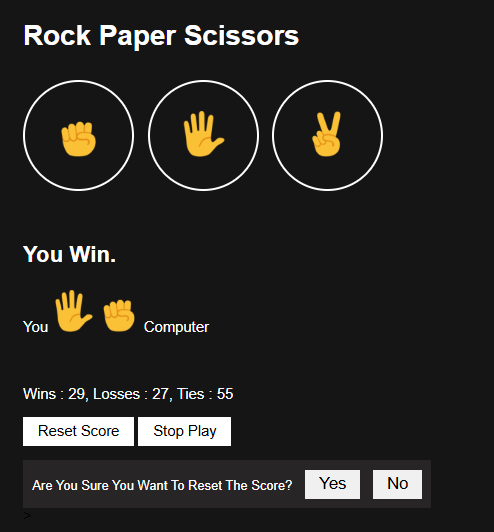

# Rock Paper Scissors Game

This is a simple Rock, Paper, Scissors game implemented with HTML, CSS, and JavaScript. The game allows the user to play against the computer. The user can choose between rock, paper, or scissors, and the computer randomly selects its choice. The game tracks wins, losses, and ties and allows for resetting the score. An autoplay feature is also included for automated gameplay.

### Features
- **Rock, Paper, Scissors Selection**: The user can choose rock, paper, or scissors by clicking the corresponding emoji button or using keyboard shortcuts (`r`, `p`, `s`).
- **Score Tracking**: The game keeps track of the user's wins, losses, and ties, and stores the data in `localStorage`.
- **Reset Score**: The user can reset the score after a game.
- **Auto Play**: Users can enable autoplay mode, where the game plays automatically.
- **Keyboard Support**: Play with the keyboard (`r`, `p`, `s` for choices, `a` for autoplay, space for resetting score).

### Preview

### Technologies Used
- HTML
- CSS
- JavaScript

### Getting Started
1. Clone or download the repository.
2. Open `index.html` in your browser.
3. Play the game by clicking on the buttons or using keyboard shortcuts.

### License
This project is licensed under the MIT License - see the [LICENSE](LICENSE) file for details.
